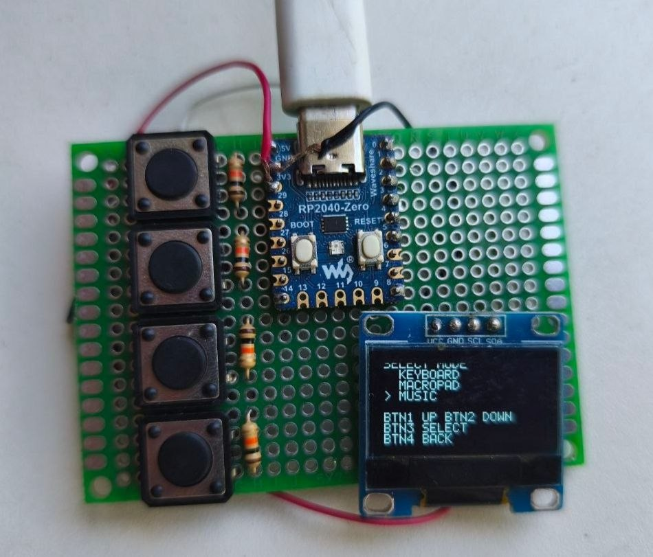
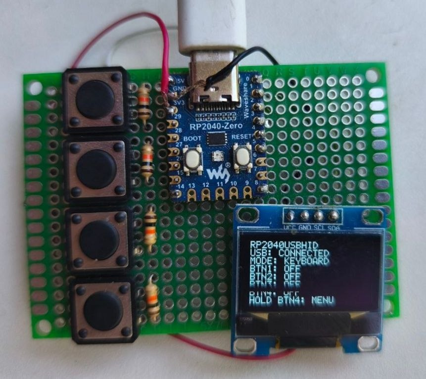
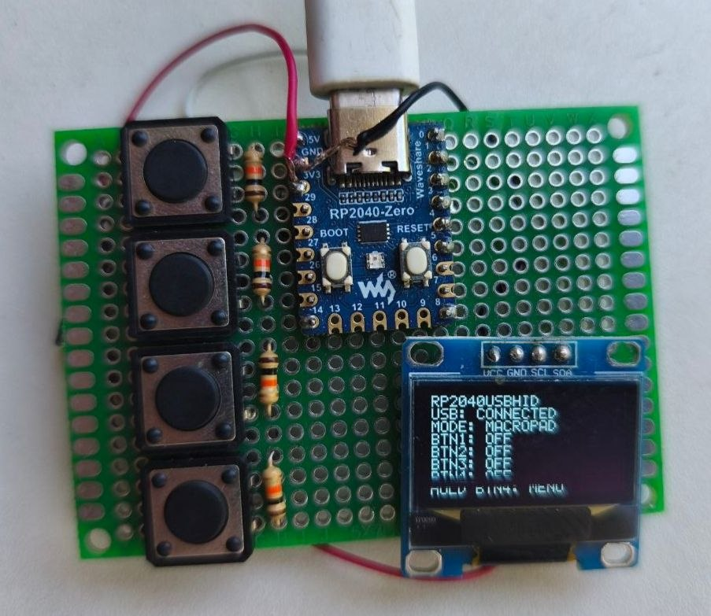
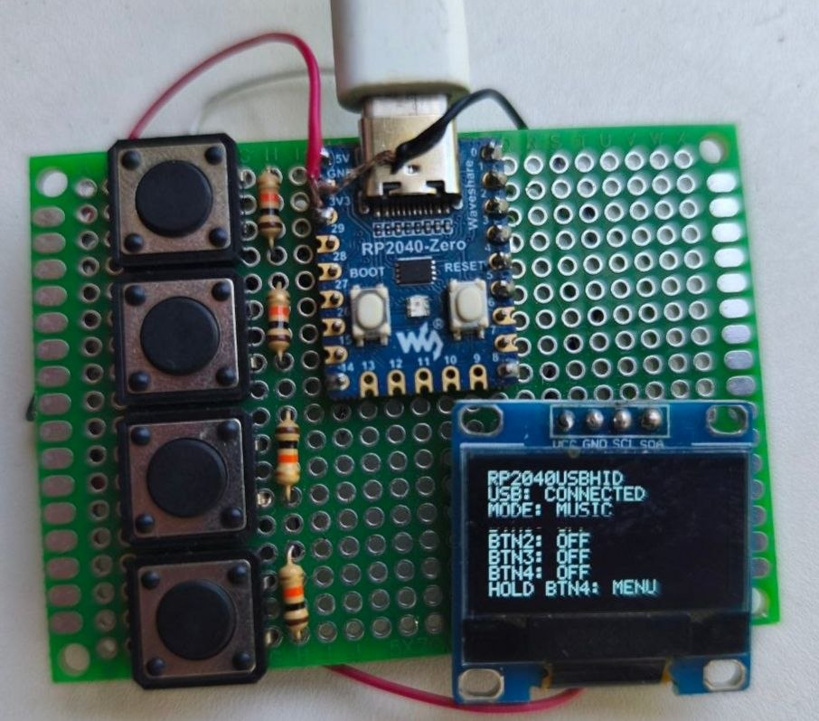

<p align="center">
  
</p>

<h1 align="center">RP2040 USB HID</h1>

<p align="center">
A multifunctional USB HID device based on <b>RP2040 Zero</b> featuring <b>Keyboard</b>, <b>MacroPad</b> and <b>Music Controller</b> modes with an OLED user interface.
</p>

<p align="center">


</p>

## Demo

🎥 Watch the project demonstration:

## https://youtu.be/WCSGy3GVpAo

# Features

- 🎮 Three operating modes
  - Keyboard
  - MacroPad
  - Music Controller
- 📺 SSD1306 OLED graphical interface
- 🔌 USB HID powered by TinyUSB
- ⚡ Raspberry Pi RP2040 Zero
- 🛠️ Written in C using Raspberry Pi Pico SDK

---

# Gallery

|            🧭 Mode Selection            |              ⌨️ Keyboard Mode               |
| :-------------------------------------: | :-----------------------------------------: |
|  |  |

|              ⚡ MacroPad Mode               |              🎵 Music Mode               |
| :-----------------------------------------: | :--------------------------------------: |
|  |  |

---

# Hardware

The device is built using the following components:

- RP2040 Zero
- SSD1306 OLED Display (128×64, I²C)
- 4 × Tactile Push Buttons
- 4 × 10 kΩ Pull-up Resistors
- Prototype PCB
- USB Type-C Cable

---

# Bill of Materials (BOM)

| Component                     | Quantity |
| ----------------------------- | -------: |
| RP2040 Zero                   |        1 |
| SSD1306 OLED Display (128×64) |        1 |
| Tactile Push Button           |        4 |
| 10 kΩ Resistor                |        4 |
| Prototype PCB                 |        1 |
| USB Type-C Cable              |        1 |

---

# Schematic

<p align="center">

</p>

📄 **Complete schematic (PDF)**

[RP2040_USB_HID_Schematic.pdf](docs/Schematic.pdf)

---

# Pinout

| Signal   |  GPIO |
| -------- | ----: |
| OLED SDA | GPIO0 |
| OLED SCL | GPIO1 |
| BTN1     | GPIO2 |
| BTN2     | GPIO3 |
| BTN3     | GPIO4 |
| BTN4     | GPIO5 |

---

# Keyboard Mode

| Button | Function |
| ------ | -------- |
| BTN1   | Ctrl + C |
| BTN2   | Ctrl + V |
| BTN3   | Enter    |
| BTN4   | Esc      |

---

# MacroPad Mode

| Button | Function   |
| ------ | ---------- |
| BTN1   | Ctrl + S   |
| BTN2   | Ctrl + Z   |
| BTN3   | F5         |
| BTN4   | Shift + F5 |

---

# Music Controller Mode

| Button | Function     |
| ------ | ------------ |
| BTN1   | Volume Down  |
| BTN2   | Play / Pause |
| BTN3   | Volume Up    |
| BTN4   | Next Track   |

---

# Project Structure

```text
RP2040-USB-HID
│
├── docs
│   ├── Schematic.pdf
│   └── Schematic.png
│
├── images
│   ├── banner.png
│   ├── keyboard.jpg
│   ├── macropad.jpg
│   ├── menu.jpg
│   └── music.jpg
│
├── inc
├── src
├── LICENSE
├── README.md
└── CMakeLists.txt
```

---

# Build

```bash
mkdir build
cd build
cmake ..
ninja
```

---

# Software

- Raspberry Pi Pico SDK
- TinyUSB
- CMake
- ARM GNU Toolchain

---

# Future Improvements

- Rotary Encoder support
- User-configurable key mapping
- RGB LED effects
- Persistent settings in Flash
- Additional HID profiles

---

# License

This project is licensed under the **MIT License**.

See the [LICENSE](LICENSE) file for details.

---

<p align="center">

Developed by **Kyrylo Sokolenko (wodi0152)**

Made with ❤️ using Raspberry Pi RP2040, TinyUSB and C.

</p>
