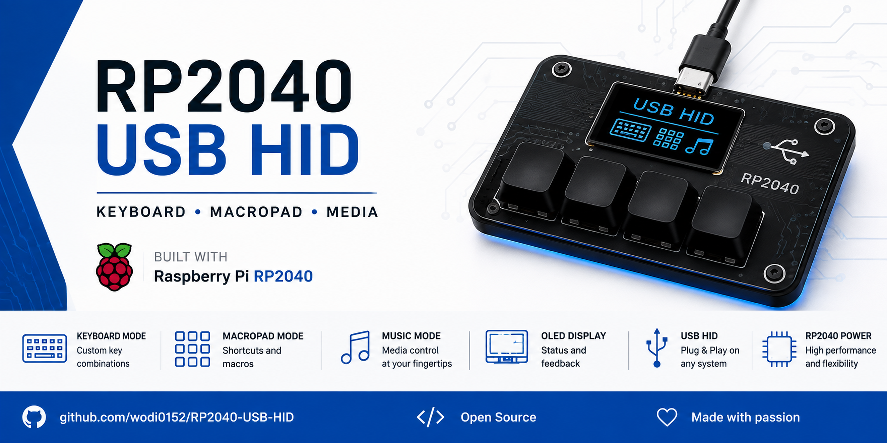
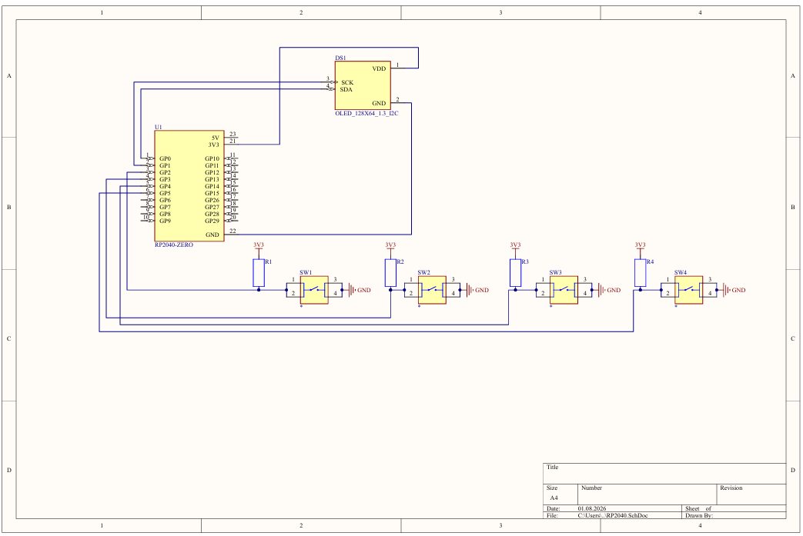

<p align="center">
  
</p>

<h1 align="center">RP2040 USB HID</h1>

<p align="center">
Keyboard • MacroPad • Music Controller
</p>


---

## Features

- Keyboard Mode
- MacroPad Mode
- Music Mode
- SSD1306 OLED Display
- TinyUSB HID
- Raspberry Pi RP2040

---

## Hardware

- RP2040 Zero
- SSD1306 OLED 128×64
- 4 Push Buttons

---

## Pinout

| Signal | GPIO |
|---------|------|
| BTN1 | GPIO2 |
| BTN2 | GPIO3 |
| BTN3 | GPIO4 |
| BTN4 | GPIO5 |
| OLED SDA | GPIO0 |
| OLED SCL | GPIO1 |

---

## Keyboard Mode

| Button | Action |
|--------|--------|
| BTN1 | Ctrl + C |
| BTN2 | Ctrl + V |
| BTN3 | Enter |
| BTN4 | Esc |

---

## MacroPad Mode

| Button | Action |
|--------|--------|
| BTN1 | Ctrl + S |
| BTN2 | Ctrl + Z |
| BTN3 | F5 |
| BTN4 | Shift + F5 |

---

## Music Mode

| Button | Action |
|--------|--------|
| BTN1 | Volume Down |
| BTN2 | Play / Pause |
| BTN3 | Volume Up |
| BTN4 | Next Track |

---

## Build

```bash
mkdir build
cd build
cmake ..
ninja
```

---

Made with ❤️ using Raspberry Pi RP2040 and TinyUSB.

---

# Hardware

The project is based on **RP2040 Zero**, an **SSD1306 OLED (I²C)** display and four push buttons.

## Schematic

<p align="center">
    
</p>

📄 Full schematic:

[RP2040_USB_HID_Schematic.pdf](docs/Schematic.pdf)